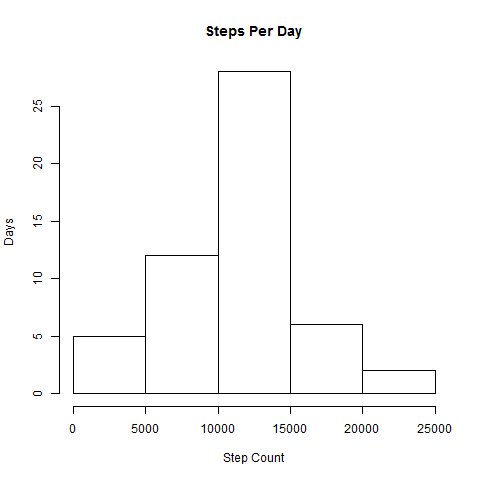
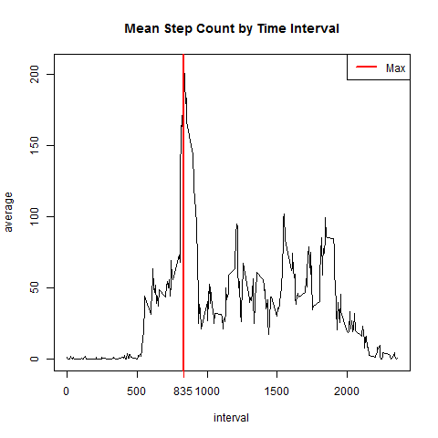
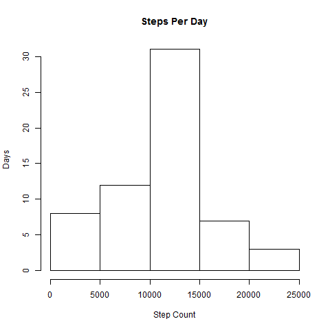
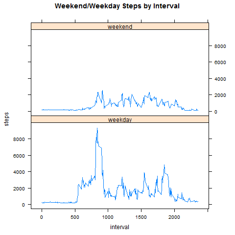

```{r setup, include=FALSE}
knitr::opts_chunk$set(echo = TRUE)
```

## Analysis of Personal Activity Monitoring Data
### By Daniel Bonnin
***

```{r, echo=FALSE, include=FALSE}
library(dplyr)
library(lattice)
```

#### Read in the data and count steps per day.

```{r, echo=TRUE}
thedata <- read.csv("activity.csv") %>%
tbl_df()
bydate <- group_by(thedata, date)
png("plot1.png")
summarize(bydate, sum(steps))$`sum(steps)` %>%
hist(main="Steps Per Day", xlab="Step Count", ylab="Days")
dev.off()
```



```{r, echo=TRUE}
sums <- summarize(bydate, sum(steps))
names(sums) <- c("date", "steps")
# src for removing scientific notation: http://stackoverflow.com/questions/30888631
options(scipen=999)
themean <- round(mean(sums$steps, na.rm=TRUE), digits=1)
themed <- round(median(sums$steps, na.rm=TRUE), digits=1)
```

#### Daily Steps averages with "NA"s removed

Mean | Median
---|----
`r I(themean)` | `r I(themed)`


#### Group step counts by 5-minute interval

```{r, echo=TRUE}
ivls <- group_by(thedata, interval)
means <- summarize(ivls, mean(steps, na.rm=TRUE))
names(means) <- c("interval", "average")
png("plot2.png")
plot(means, type="l", main="Mean Step Count by Time Interval")
maxivl <- means[max(means$average) == means$average,1]
abline(v=maxivl, col="red", lwd=2)
axis(1, at=maxivl, labels=maxivl, col="red")
legend("topright", "Max", lwd = 2, col="red")
dev.off()
```


#### Impute missing steps data by using the time interval mean

```{r, echo=TRUE}
numnas <- sum(is.na(thedata$steps))
means <- mutate(means, average = round(average))
imputed <- thedata
imputed$steps[is.na(imputed$steps)] <- merge(imputed[is.na(imputed$steps),], means, by="interval")[,"average"]
bydate <- group_by(imputed, date)
png("plot3.png")
summarize(bydate, sum(steps))$`sum(steps)` %>%
hist(main="Steps Per Day", xlab="Step Count", ylab="Days")
dev.off()
sums <- summarize(bydate, sum(steps))
names(sums) <- c("date", "steps")
themean <- round(mean(sums$steps, na.rm=TRUE), digits=1)
themed <- round(median(sums$steps, na.rm=TRUE), digits=1)
```



#### Number of "NA"s replaced: `r I(numnas)`


#### Daily Steps averages with "NA"s imputed

Mean | Median
---|----
`r I(themean)` | `r I(themed)`


#### Group by weekend/weekday

```{r, echo=TRUE}
byisweekend <- mutate(imputed, dow = weekdays(as.Date(imputed$date))) %>%
  mutate(daytype = ifelse(dow %in% c("Saturday", "Sunday"), "weekend", "weekday")) %>%
  mutate(daytype = as.factor(daytype)) %>%
  select(steps, interval, daytype) %>%
  group_by(daytype, interval) %>%
  summarize(sum(steps))
names(byisweekend) <- c("daytype", "interval", "steps")
png("plot4.png")
xyplot(steps~interval | daytype, data=byisweekend, type="l", layout=c(1, 2), main="Weekend/Weekday Steps by Interval")
dev.off()
```

